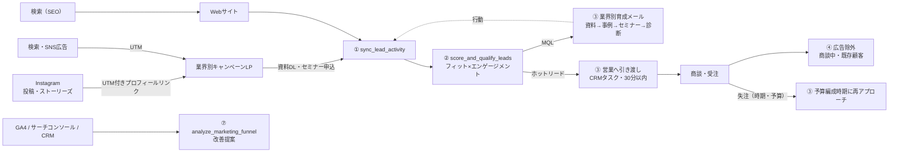

# BtoB デジタルマーケティング AIエージェント

BtoB（企業間取引）向けに、Webサイト・LP・Instagram・メール・ウェビナー・広告のデータを使い、**見込み顧客の獲得 → 育成 → 見極め → 営業への引き渡し → 商談化**までを実行・改善するAIエージェントです。

BtoBは検討期間が長く、複数人が意思決定に関わります。そのため、このエージェントは次の方針で判断します。

- リード数やリード単価（CPL）ではなく、**商談化（SQL・商談金額）** で評価します。
- 同一企業の複数担当者の動きも評価します。
- ホットリードは**30分以内に営業へ引き渡します**。
- 失注したリードには、**予算編成時期に合わせて再アプローチ**します。

| 収録物 | 場所 |
|---|---|
| ツール定義（JSON Schema・7本） | `schemas/`（OpenAI / LangChain 形式と Claude API 形式は `schemas/export/`） |
| Claude Code 用エージェントと Skill | `.claude/agents/btob-marketing-agent.md`, `.claude/skills/`（8本） |
| 実行基盤（Python） | `src/dm_agent/` |
| クライアント別設定 | `config/clients/<client_id>.json` |
| ガードレール | `config/policy.json` |

---

## 1. 3つの基本ステップとスキルの対応

| ステップ | 目的 | スキル |
|---|---|---|
| リード獲得（リードジェネレーション） | SEO・Web広告・Instagram・資料DL・ウェビナーで企業と担当者の情報を集める | `optimize_lead_gen_campaigns`, `build_utm_tracking_url`, `plan_social_content_calendar` |
| リード育成（リードナーチャリング） | 業界別のメール・セミナーで検討度を高める | `trigger_nurture_action`（育成シナリオ・メール・セミナー招待・資料推奨） |
| リードの見極め（リードクオリフィケーション） | 行動データからホットリードを見極め、営業へ引き渡す | `score_and_qualify_leads`, `trigger_nurture_action`（sales_handoff） |
| 共通（データ・分析） | 行動データの統合と、流入からファネルまでの分析 | `sync_lead_activity`, `analyze_marketing_funnel` |



## 2. 想定ケースへの適用（サンプル設定）

`config/clients/sample_sales_consulting.json` には、今回の相談内容をもとにした設定を入れています。

| 項目 | 設定内容 |
|---|---|
| 事業 | 中小企業の営業組織を仕組み化する営業コンサル（架空） |
| ターゲット | 中小のIT企業、製造業の営業組織（クライアントによって異なるため、業界別に配点・シナリオ・投稿テーマを分けています） |
| Instagram | これから立ち上げ。プロフィールは業界共通の課題でまとめ、投稿テーマは業界別に分けます。ハイライトは「IT企業の実績」「製造業の実績」 |
| Webサイト | 既存サイトあり。GA4・UTM・サーチコンソールで流入を分析します |
| LP | キャンペーンごとに作成します。LPごとのCVRと商談化はファネル分析（landing_page 軸）で比較します |

### 推奨の進め方（目安）

| 時期 | 実施内容 | 担当（想定） | 使うスキル | KPI |
|---|---|---|---|---|
| 1〜2週目 | GA4で資料DL完了をキーイベントに設定、サーチコンソールを連携、UTM命名ルールを確定 | Web担当 | `build_utm_tracking_url` | 計測漏れ（UTMなしのLP流入）ゼロ |
| 2週目 | Instagramのプロフィール設計、業界別のプロフィールリンク（UTM付き）の作成 | SNS担当 | `plan_social_content_calendar`（account_status: new） | プロフィール完成 |
| 3週目〜 | 週2〜3回の投稿（月: 図解カルーセル、金: 事例。水: 中の人リールは任意）、セミナー告知ストーリーズ | SNS担当 | `plan_social_content_calendar` | 保存数、プロフィールアクセス率 |
| 常時 | 資料DL後の自動スコアリング、業界別育成、ホットリードの30分以内の引き渡し | MA担当・インサイドセールス | ②③ と自動化ルール | 初回接触までの時間、SQL率 |
| 毎月 | ファネル分析・改善提案、広告の予算調整、スコア配点の見直し | マーケ責任者 | ⑦④② | 資料DL数、SQL数、商談金額、商談化単価 |

## 3. クイックスタート

```bash
pip install -e ".[dev,llm]"

python -m dm_agent demo              # BtoBシナリオを実行（メール・CRM・広告はモック接続に反映）
python -m dm_agent demo --dry-run    # 反映せず計画のみ
python -m pytest                     # テスト（29件）
```

`demo` では、サンプルデータを使って次の流れを再現します。

0. Instagramプロフィール用のUTM付きURLを作成し、命名ルール違反の例（`Instagram`、日本語のキャンペーン名）も検出します。
1. 9/7(月) 20:30、Instagram経由で製造業の営業責任者が資料をDLします。自動でスコアリングされてMQLになり、製造業向けの育成シナリオに登録されます。
2. 営業時間外のため、初回メールは翌日9:00に送信されます（配信停止リンク・UTMつき）。
3. 9/10、セミナー参加と料金ページ閲覧でホットリードになります。CRMに初回接触タスク（期限は30分後）が作られます。同じ企業の役員の閲覧も加味されます。
4. 商談設定を受けて、Google・Metaの配信から商談中・既存顧客を除外します。
5. 別リードの失注（理由: 時期）を受けて、2027年1月4日（予算編成時期と仮定。年末年始を避けています）に再アプローチのタスクを作ります。
6. Meta広告の予算を減らす案（承認待ち）と低成果クリエイティブの停止を出し、2週間分の投稿カレンダーとファネル分析レポートを作成します。

### スキルを個別に実行する

```bash
python -m dm_agent call build_utm_tracking_url '{"base_url":"https://example.com/lp/it-toss-criteria","utm_source":"instagram","utm_medium":"social","utm_campaign":"it_paper","placement":"instagram_story","target_industry":"it_saas"}'
python -m dm_agent call analyze_marketing_funnel '{"period_start":"2026-09-01","period_end":"2026-09-30","group_by":"landing_page"}' --client sample_sales_consulting
```
状態は `state/<client_id>.json` に保存されます。

## 4. エージェントとして使う

### A. Claude Code
このリポジトリを開くと、`btob-marketing-agent` と8つの Skill が読み込まれます。
例:「btob-marketing-agent で、先月のファネルを分析して、商談化しない原因と改善策をまとめて」

### B. Claude API（自律実行ループ）
```bash
export ANTHROPIC_API_KEY=...
python -m dm_agent agent "Instagram経由のリードが商談化しているか分析し、来月の投稿方針を提案して" --scenario
```
- モデルの既定は `claude-opus-5` です（`--model` で変更可能）。adaptive thinking を有効にしています。
- 拒否応答時に代替モデルへ切り替えるサーバー側フォールバック（`fallbacks="default"`）を有効にしています。
- Claude が選んだツール呼び出しにも、スキーマ検証・ガードレール・監査ログが同じように適用されます。

### C. OpenAI Functions / LangChain など
`schemas/export/tools.openai.json` を読み込み、ツール呼び出しを `AgentRuntime(client_id=...).execute(name, args)` に渡してください。

## 5. ガードレール（`config/policy.json`。数値は初期値の仮置きです）

| 区分 | 項目 | 初期値 | 動作 |
|---|---|---|---|
| 全体 | execution_mode | `dry_run` | `live` のときだけメール・CRM・広告へ反映 |
| 全体 | 営業時間 | 平日9:00〜18:00（年末年始休業） | メール配信・初回接触期限の計算に使用。祝日は未対応 |
| メール | 配信同意・配信停止 | 必須 | `blocked`（特定電子メール法。配信停止リンク・送信者情報は自動付与） |
| メール | 頻度上限／同一資料の再送 | 7日で2通／30日 | `blocked` |
| 営業連携 | 引き渡し条件 | ホットリードのみ | それ以外は `blocked` |
| 営業連携 | 初回接触期限 | 営業時間内30分 | CRMタスクの期限に設定し、分析で達成状況を確認 |
| 広告 | 予算変更幅／承認 | ±20%／±10%超は承認待ち | 補正・`pending_approval` |
| 広告 | 予算判断に必要なSQL | 3件 | 未満は判断保留（SQL0件で目標の2倍以上を消化した場合は減額） |
| 広告 | 入札変更に必要なCV | 30件/30日 | 未満はスキップ |

スコア配点・MQL／ホットリードのしきい値は、クライアント設定（`icp` / `scoring`）にあります。**初期値は仮説のため、SQL・受注の実績を見て営業部門と合意のうえ調整してください。**

## 6. 本番導入に向けて（未実装・要対応）

| 項目 | 現状 | 本番での対応 |
|---|---|---|
| MA・メール配信 | `MockEmail` | HubSpot / Marketo / SATORI 等のAPIに接続 |
| CRM（営業タスク・商談） | `MockCRM` | Salesforce / HubSpot CRM 等に接続。商談・受注・失注を `sync_lead_activity` に連携 |
| 広告媒体 | `MockAdPlatform` | Google広告 / Yahoo!広告 / Meta Marketing / LinkedIn Marketing API。SQLのオフラインコンバージョン送信も設定 |
| GA4 | サンプルJSON | GA4 Data API または BigQuery エクスポートから `ga4_sessions` を取得 |
| サーチコンソール | サンプルJSON | Search Console API から `gsc_queries` を取得 |
| Instagram | 投稿計画のみ | 投稿・インサイト取得は Instagram Graph API（ビジネスアカウント）で連携可能 |
| 祝日 | 年末年始のみ | 祝日カレンダーを `business_hours` に追加 |
| 予約ジョブ・承認 | プロセス内メモリ | ジョブキューと承認UI（Slack 等）へ移行 |

> `examples/` のデータ（企業・数値）はすべて動作確認用の架空の値で、実績ではありません。

## 7. 前バージョン（BtoC・オムニチャネル版）からの変更

店舗POS・クーポン配信を中心としたBtoC版を、BtoBのリード獲得から商談化までのファネル向けに作り替えました。前バージョンは Git の履歴から参照できます。
