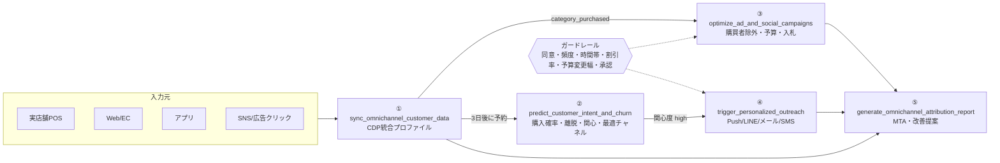

# オムニチャネル・デジタルマーケティング AIエージェント

オンライン（Web・SNS・広告・アプリ）とオフライン（実店舗POS・会員データ）をCDP上で統合し、**データ統合 → 予測 → 広告最適化 → 個別配信 → 効果測定**までを実行するAIエージェントです。

- **Skill定義（JSON Schema）**: `schemas/` … OpenAI Functions / LangChain / Claude API でそのまま読み込めます
- **Claude Code 用 Skill とエージェント**: `.claude/skills/`, `.claude/agents/digital-marketing-agent.md`
- **実行基盤（Python）**: `src/dm_agent/` … スキーマ検証・ガードレール・監査ログ・スケジューラ・自動化プレイブック・Claudeエージェントループ

---

## 1. 統合アーキテクチャ



| レイヤー | スキル | 連携先・入力元 | 出力 |
|---|---|---|---|
| 統合データ基盤 | `sync_omnichannel_customer_data` | Web行動ログ、POS、アプリログ | 統合顧客プロファイル、購買セグメント |
| 予測・分析 | `predict_customer_intent_and_churn` | 統合プロファイル、購買履歴 | 購入確率、LTV目安、離脱リスク、推奨カテゴリ、最適チャネル |
| 広告・SNS運用 | `optimize_ad_and_social_campaigns` | Google / Meta / LINE / X | 除外リスト同期、予算再配分、入札戦略、クリエイティブ停止 |
| エンゲージメント | `trigger_personalized_outreach` | MA、アプリPush、LINE、SMS | 個別メッセージ、店舗・EC共通クーポン |
| レポーティング | `generate_omnichannel_attribution_report` | 全チャネル実績、POS売上 | チャネル別貢献度、貢献ROAS、改善案 |

①〜④のスキーマは仕様書の定義をそのまま使っています。⑤は仕様書のレイヤー表をもとに新たに設計しました。

## 2. ディレクトリ構成

```
schemas/                     # ツール定義（JSON Schema）
  export/tools.openai.json   #   OpenAI / LangChain 形式（5本まとめ）
  export/tools.anthropic.json#   Claude Messages API 形式
.claude/agents/              # Claude Code サブエージェント定義
.claude/skills/              # Claude Code Skill（各スキル＋店舗×Web連動ワークフロー）
config/policy.json           # ガードレール・実行モード・ワークフロー設定
config/catalog.json          # SKU→カテゴリ、併売ルール（クロスセル候補）
src/dm_agent/
  runtime.py                 # ツール実行（スキーマ検証）・時計・予約ジョブ・イベント・承認・監査ログ
  workflow.py                # 自動化プレイブック（店舗購買→広告除外→予測→配信）
  guardrails.py              # 同意・頻度上限・配信停止時間帯・割引率・予算変更幅
  cdp.py / connectors.py     # CDPストア、広告媒体・配信チャネルのアダプタ（モック実装つき）
  skills/                    # 5スキルの実装
  llm_agent.py               # Claude による自律実行ループ
  prompts/system.md          # エージェントのシステムプロンプト
examples/scenario_store_web.json  # デモ用の架空データ
tests/                       # pytest（23件）
```

## 3. クイックスタート

```bash
pip install -e ".[dev,llm]"

python -m dm_agent demo              # 店舗×Web連動シナリオを実行（モック媒体に反映）
python -m dm_agent demo --dry-run    # 反映せず計画のみ
python -m pytest                     # テスト
```

`demo` は仕様書「3. 自動化ワークフロー例」を、シミュレーション時計で再現します。

1. 9/20 11:00 店舗レジで C001 がジャケット購入 → CDPに `outdoor_jacket` を記録
2. 直後に Google / Meta の「ジャケット購買検討者リマーケティング」から除外
3. 9/23 11:00（3日後）に予測 → 防水スプレー・登山靴の関心度が high
4. 同意済みのアプリPushで「店舗・EC共通 10%OFFクーポン」を配信

続けて予算再配分（承認待ちになる）、入札戦略変更、低成果クリエイティブ停止、アトリビューションレポートを実行し、`reports/` にレポートと監査ログを保存します。

### スキルを個別に実行する

```bash
python -m dm_agent call sync_omnichannel_customer_data examples/my_events.json
python -m dm_agent call predict_customer_intent_and_churn '{"customer_id":"C001","prediction_targets":["churn_risk","optimal_channel"]}'
```
状態は `state/cdp.json` に保存されます。

## 4. エージェントとして使う

### A. Claude Code（このリポジトリを開いて使用）
`.claude/agents/digital-marketing-agent.md` がサブエージェント、`.claude/skills/` の6つが Skill として読み込まれます。
例:「digital-marketing-agent で、離脱リスクが高い顧客を抽出して配信計画を立てて」

### B. Claude API（自律実行ループ）
```bash
export ANTHROPIC_API_KEY=...
python -m dm_agent agent "C006の離脱リスクを確認し、必要なら最適チャネルでフォロー配信を計画して" --scenario
```
- モデルの既定は `claude-opus-5`（`--model` で変更可能）。adaptive thinking を有効にしています。
- モデルが応答を拒否した場合に代替モデルへ自動で切り替えるサーバー側フォールバック（`fallbacks="default"`）を既定で有効にしています。不要な場合は `llm_agent.py` の該当2行を削除してください。
- Claude が選んだツール呼び出しも `AgentRuntime.execute` を経由するため、スキーマ検証・ガードレール・監査ログが同じように適用されます。

### C. OpenAI Functions / LangChain / その他
`schemas/export/tools.openai.json` を読み込み、ツール呼び出しを受け取ったら `AgentRuntime().execute(name, args)` に渡してください。

## 5. ガードレール（`config/policy.json`）

| 区分 | 項目 | 初期値 | 動作 |
|---|---|---|---|
| 全体 | execution_mode | `dry_run` | `live` のときだけ媒体・配信へ反映 |
| 広告 | 1日の予算変更幅 | ±20% | 超過分は補正 |
| 広告 | 承認が必要な変更幅 | ±10%超 | `pending_approval` として保留 |
| 広告 | 入札戦略変更に必要なCV | 30件/30日 | 未満はスキップ |
| 広告 | クリエイティブ停止 | 表示1,000回以上・CTRが平均の50%未満 | 最後の1本は停止しない |
| 配信 | 配信同意 | 必須 | 未同意チャネルは `blocked` |
| 配信 | 頻度上限／同一シナリオの間隔 | 7日3通／7日 | `blocked` |
| 配信 | 配信停止時間帯 | 21:00〜8:00（Push/SMS/LINE） | 翌8:00に予約 |
| 配信 | 割引率上限 | 20% | `blocked` |

**これらの数値は初期設定の仮置きです。** 運用前に広告主・法務（個人情報保護法、特定電子メール法、景品表示法）と合意した値に置き換えてください。

## 6. 本番導入に向けて（未実装・要対応）

| 項目 | 現状 | 本番での対応 |
|---|---|---|
| 広告媒体API | `MockAdPlatform`（呼び出しを記録するだけ） | `connectors.py` の `AdPlatform` に沿って Google Ads / Meta Marketing / LINE / X Ads API のアダプタを実装 |
| 配信チャネル | `MockMessaging` | MAツール・Firebase・LINE Messaging API・SMSゲートウェイのアダプタを実装 |
| CDP | インメモリ＋JSON保存 | BigQuery / Snowflake / 既存CDPのアダプタに置き換え（`CDPStore` と同じメソッドを実装） |
| 予測モデル | ルールベース（説明可能な基準モデル） | 購買ラベル付きの履歴が十分たまった段階で学習モデルに置き換え |
| data_driven_mta / mmm | 未接続（position_based で代替し、その旨を注記） | 外部の分析ジョブ（Shapley/Markov、Meridian/Robyn 等）と接続 |
| 予約ジョブ・承認キュー | プロセス内メモリ | ジョブキュー（Cloud Tasks 等）と承認UI（Slack 等）へ移行 |

### 仕様への拡張提案（スキーマは仕様書どおりのまま、実装側で対応済み／提案のみ）
- `event_type` に EC購入（`ec_purchase`）と来店（`store_visit`）がありません。現在は `store_purchase` の `channel` で店舗購買とEC購買を区別しています。「来店したが買わなかった」を検知するには `store_visit` の追加をおすすめします。
- `optimize_ad_and_social_campaigns` に予算額を指定する項目がないため、`update_budget` は「媒体内の総額を変えずに、目標ROAS/CPAとの差で配分し直す」自動配分として実装しています。
- 実行モード（dry_run / live）はスキーマではなく、ポリシー設定で一括管理しています。

> サンプルデータ（`examples/`）の数値はすべて動作確認用の架空の値で、実績ではありません。
